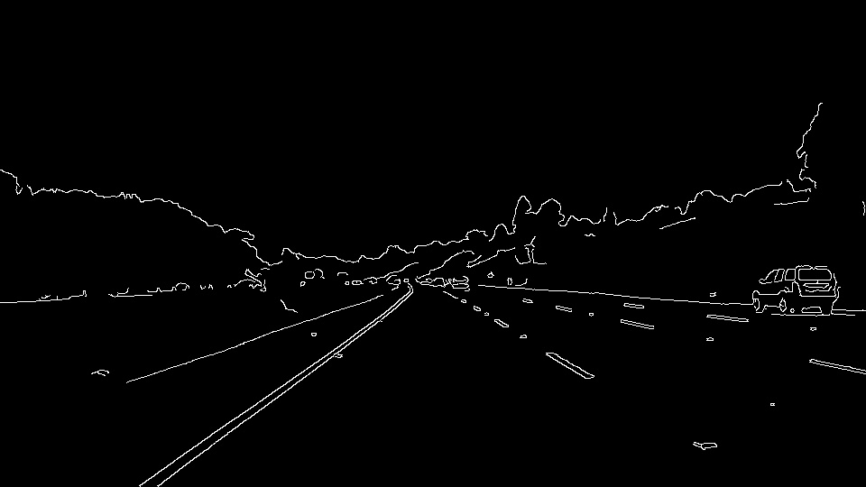
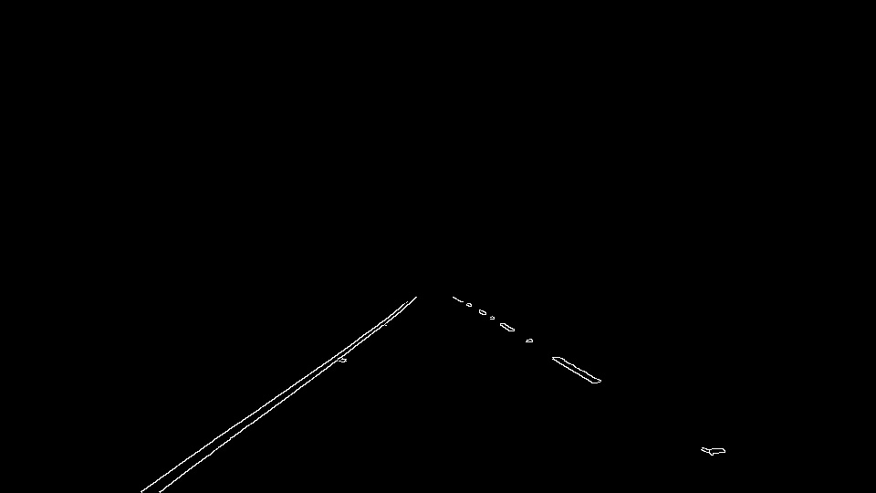
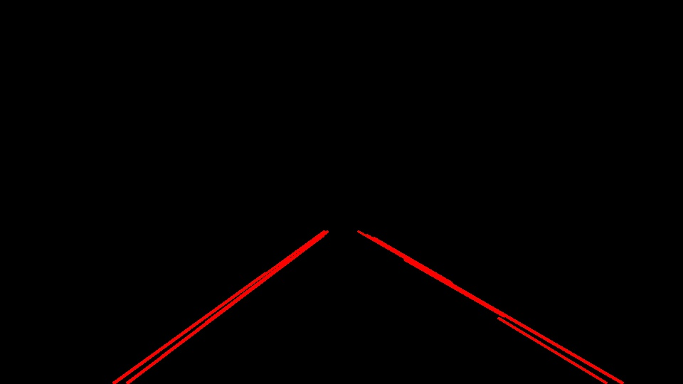
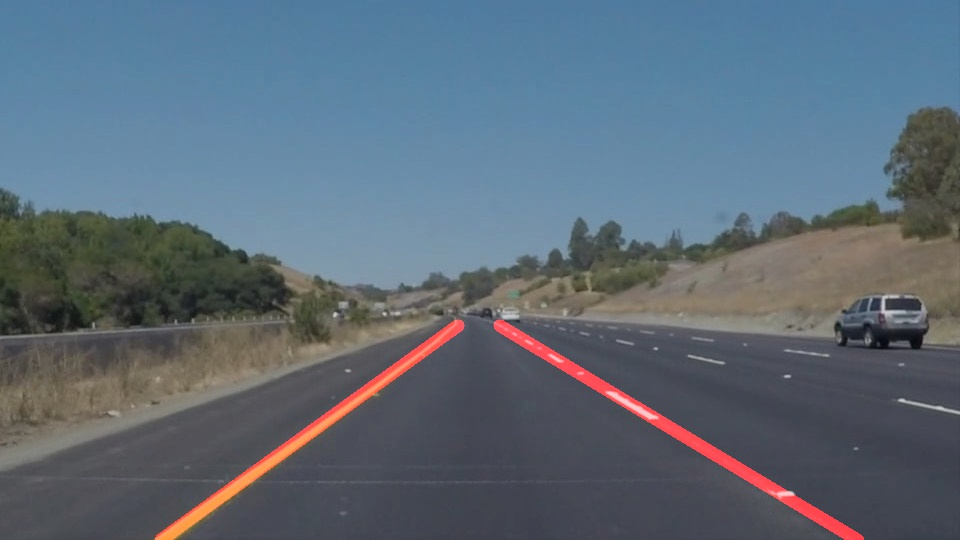

# Finding-Lane-Lines
When we drive, we use our eyes to decide where to go. The lines on the road that show us where the lanes are and act as our constant reference for where to steer the vehicle.
This simple algorithm finds lanes with the help of the lane lines drawn on the road. It was developed/coded during the "Self-Driving Car Engineer"-Nanodegree program on Udacity.

The algorithm uses following pipeline:
  1. Preprocessing the input RGB image
      * Convert to greyscale
      * Apply a Gaussian blur
  2. Feature Extraction
      * Detect edges with the Canny edge detection algorithm (Image 1)
      * Mask with a trapezoidal mask (Image 2)
  3. Classification
      * Filter and classify lines with the hough transformation (Image 3)
      * Calculate the needed parameters for the single lines for the right and left lanes
  4. Draw lines on the original image (see example output)
  
| Image 1 | Image 2 | Image 3 |
| :---: | :---: | :---: |
|   |  |  |
| Canny | Masked | Hough lines |  

## Currently shortcomings
  
  * lane lines not detected, when not really differ from asphalt color or lack totally
  * curves in cities with a small radius (e.g. corners)
  
## How to run the code?

  1. Download the files;
  2. Run the main.py
  3. See the results saved into the _output folders.
  
## Example output

You can find example videos in the test_videos_output folder.

